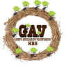

<h1 align="center">Voluntarios-Digitais-XP-39</h1>

<h1 align="center">
  
</h1>

  <a href="#-tecnologias">Tecnologias</a>&nbsp;&nbsp;&nbsp;|&nbsp;&nbsp;&nbsp;
  <a href="#-projeto">Projeto</a>&nbsp;&nbsp;&nbsp;|&nbsp;&nbsp;&nbsp;
  <a href="#-layout">Layout</a>&nbsp;&nbsp;&nbsp;|&nbsp;&nbsp;&nbsp;
  <a href="#memo-licença">O GAV</a>

  

 

  

## 🚀 Tecnologias

Esse projeto foi desenvolvido com as seguintes tecnologias:

- HTML
- CSS

## 💻 Projeto

Ajudar a ONG com presença digital. Escolher, de preferência, uma ONG que não possua site e/ou redes sociais;
Então, execute a transformação digital dessa ONG baseada em uma demanda real (não adianta fazer um site sem ensiná-los a atualizar) Lembrem-se que aqui o que importa é realmente ajudar;

## 👉 O GAV

É grupo filantrópico, legalmente constituído sob a forma de sociedade civil, sem fins lucrativos, sem ideologia política-religiosa. Tem por objetivo congregar pessoas da sociedade do Distrito Federal que queiram doar, de alguma forma, parte do seu tempo em prol dos pacientes carentes internados e/ou em tratamento no Hospital Regional de Sobradinho/DF (HRS) e em situação de vulnerabilidade social conforme orientação do Serviço Social do HRS.

## 🔖 Layout

Você pode visualizar o layout do projeto através [desse link](https://www.figma.com/file/YXM0qfU6tZ1FRxLoLxSQiQ/Projeto-GAV?node-id=0%3A1). É necessário ter conta no [Figma](https://figma.com) para acessá-lo.

---

Feito com ♥ by Grupo 5 Do Desafio Voluntarios Digitais da    XP-39
